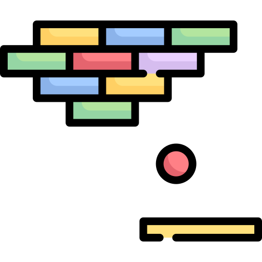

# Table Of Contents
- [Table Of Contents](#table-of-contents)
- [Arcanoid](#arcanoid)
  - [Introduction](#introduction)
  - [General Info](#general-info)
    - [Multiplayer](#multiplayer)
      - [Video](#video)
      - [Database](#database)
    - [Singleplayer](#singleplayer)
      - [Video](#video-1)
  - [Code Example](#code-example)

----------------------------
# Arcanoid
<p align="center">
  
</p>


## Introduction
Simple implementation of very popular game [Arcanoid](https://en.wikipedia.org/wiki/Arkanoid). Two game modes `multiplayer` and `singleplayer` allow to play with friends and break your records. Video of both modes are avaible in [multiplayer](#video) [singleplayer](#video-1)


## General Info
Each user register his nickname in database. Registration is automatical, it does mean that first login stores nickname in database ( if nickname is available). 

### Multiplayer
When user want to play with friends he need to join or create a room. Each room contains Game configuration (rows, columns, mode(EASY,HARD,MEDIUM)). Room may be created by every user and configured as only he wish.

Lobby is a list of rooms that are open
 at the moment. By clicking list item player joins as a guest and contest begin. The one who first destroys all the bricks wins. 

#### Video
https://user-images.githubusercontent.com/43937286/117873213-d3ecfc80-b29f-11eb-9aab-1ddb09e2f876.mp4

#### Database
Communication is owed to the firebase.
Players listening opponents score and communicating in real time in such way.


### Singleplayer
When user playing singleplayer mode he just beat next stages and local `room` database stores his achievements ( records ).

#### Video
https://user-images.githubusercontent.com/43937286/117873233-da7b7400-b29f-11eb-8744-9b43241c9d68.mp4

## Code Example

```kotlin

private fun addScoreListener() {
    messageReference.addValueEventListener(object : ValueEventListener {
        override fun onDataChange(snapshot: DataSnapshot) {
            if (snapshot.getValue(String::class.java) != null) {
                game_view.pauseThread()
                basicAlert(snapshot.getValue(String::class.java))
                closeRoom()

            }
        }

        override fun onCancelled(error: DatabaseError) {
            messageReference.setValue(message)
        }

    })
}

```

----------------------------
